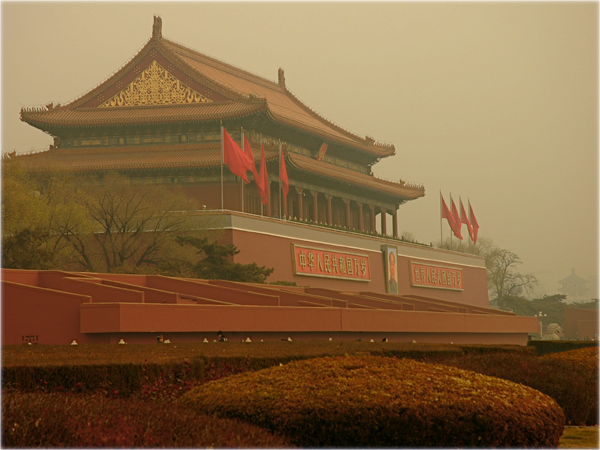

# FogRemoval-AODNET

This repository consists the code for the testing and implemetation of the AOD NET for fog removal on the hazy images using transmission maps and atmospheric guided light. The pretrained weights of the models are used to test the model on the images. The pytorch implemetation of the All in One Networkm for Dehazingn was inspired from this [Repo](https://github.com/walsvid/AOD-Net-PyTorch).

The results acheived are as shown below:

 

